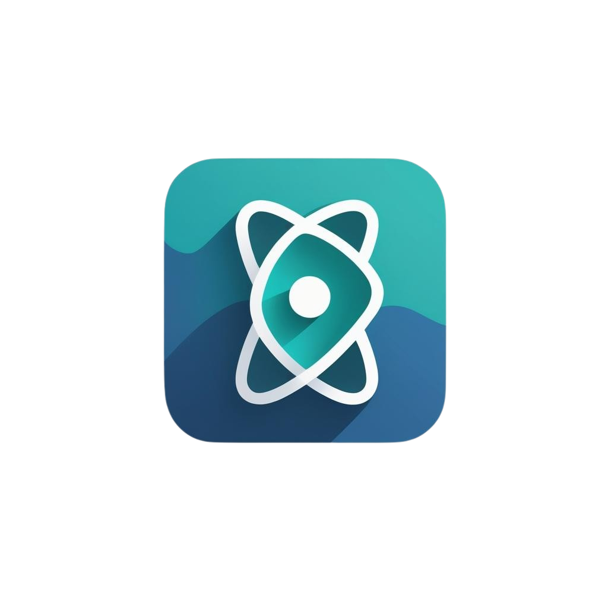

<h1 align="center">
  
  <br/>
  Fast Calendar
</h1>

<h4 align="center">
  A fast-to-use React Calendar library built for <a href="https://mui.com/" target="_blank">MUI</a>.
</h4>

<p align="center">
  <a href="#key-features">Key Features</a> •
  <a href="#how-to-use">How To Use</a> •
  <a href="#theming">Theming</a> •
  <a href="#events">Events</a> •
  <a href="#customization">Customization</a> •
  <a href="#development">Development</a> •
</p>

-- Gif Demo example --

## Key Features

-   **Fast**: Built with performance in mind, Fast Calendar is optimized for speed and efficiency.
-   **Lightweight**: Minimal dependencies and a small footprint ensure quick load times.
-   **Customizable**: Easily style and configure the calendar to fit your application's design.
-   **Responsive**: Works seamlessly across devices, adapting to different screen sizes.
-   **Easy to Use**: Simple API and clear documentation make integration a breeze.
-   **MUI Integration**: Built specifically for MUI, ensuring a consistent look and feel with your existing components.
-   **Accessibility**: Designed with accessibility in mind, ensuring all users can interact with the calendar.

## How To Use

To use Fast Calendar in your MUI project, follow these steps:

1. **Install the package**:

    ```bash
    npm install @mui/material @mui/styled-engine-sc styled-components fastcalendar
    ```

2. **Import the component**:

    ```javascript
    import { FastCalendar } from "fastcalendar";
    ```

3. **Use the component in your JSX**:
    ```javascript
    <FastCalendar
        events={yourEvents} // Check the Events section for more details
    />
    ```

## Theming

Fast Calendar uses MUI's theming capabilities. You can customize the calendar's appearance by wrapping it in a `ThemeProvider` and passing your theme.

```javascript
// app.tsx (or layout.tsx)
import React from 'react';
import ReactDOM from 'react-dom/client';

import { createTheme, ThemeProvider } from "@mui/material/styles";
import CssBaseline from "@mui/material/CssBaseline";

import { FastCalendar } from "fastcalendar";

const theme = createTheme({
    palette: {
        // Customize your theme here
        mode: "dark",
        primary: {
            main: "#1976d2",
        },
        secondary: {
            main: "#f50057",
        },
        background: {
            default: "#121212",
            paper: "#1976d2",
        },
    },
});

ReactDOM.createRoot(document.getElementById('root')!).render(
    <ThemeProvider theme={theme}>
        <CssBaseline />
        <App />
    </ThemeProvider>
);
```

## Events

Fast Calendar supports a variety of events that can be passed to the component. Events are objects with the following structure:

```typescript
type CalendarEvent {
    id: string; // Unique identifier for the event
    title: string; // Title of the event
    start: Date; // Start date and time of the event
    end: Date; // End date and time of the event
    allDay?: boolean; // Optional, true if the event lasts all day
    color?: string; // Optional, custom color for the event
}
```

`CalendarEvent` is the type for each event object. You can import it from the library:

```typescript
import { type CalendarEvent } from "fastcalendar";
```

### Start using events

To start using events, you have to use `useEvents` hook, which provides a way to manage events in your calendar easily.
This hook returns objects with the following properties:

```typescript
type useEvents {
    events: CalendarEvent[]; // Array of current events
    loading: boolean; // Indicates if events are currently being loaded
    error: Error | null; // Error object if there was an issue loading events
    refresh: () => void; // Function to refresh the events
}
```

`useEvents` takes a function as an argument that returns a promise resolving to an array of `CalendarEvent` objects. This function is called whenever the calendar needs to load events.

```javascript
import { useEvents, type CalendarEvent } from "fastcalendar";

const fetchEvents = async (): Promise<CalendarEvent[]> => {
    const response = await fetch("https://example.com/api");
    if (!response.ok) {
        throw new Error("Failed to fetch events");
    }
    const data = await response.json();
    return data as CalendarEvent[];
};

const { events, loading, error, refresh } = useEvents({fetchEvents});

return (
    <FastCalendar
        events={events}
    />
)
```

### Data state management
Fast Calendar provides `loading`, `error`, and `refresh` properties to manage the state of your events data. You can use these properties to show loading indicators, handle errors, or refresh the event list.

If you want to let Fast Calandar handle states for you, you can pass them from `dataState` prop:

```javascript
<FastCalendar
    events={events}
    dataState={{
        loading: loading,
        error: error,
    }}
/>
```

## Customization

You can customize components by using `components` prop:

```javascript
<FastCalendar
    events={events}
    components={{
        loading: () => <div>Loading...</div>,
        error: (props) => <div>Error: {props.error.message}</div>,
    }}
/>
```

## Development

To run the project locally during development:

```bash
# Clone the repository
git clone https://github.com/Mattis44/FastCalendar.git
cd fastcalendar

# Install dependencies
npm install

# Run the development server
npm run dev

# Install fastcalendar as a local dependency from a project with MUI
npm install --save ../fastcalendar
```

### Code Structure Overview

- `components/`: React components (calendar UI, header, etc.)
- `hooks/`: Custom hooks like `useEvents`
- `types/`: TypeScript types
- `utils/`: Reusable functions (e.g., date helpers, rendering utilities)

## Contributing

Contributions are welcome! To contribute:

1. Fork the repository
2. Create a new branch: `git checkout -b feature/your-feature-name`
3. Make your changes
4. Submit a pull request

Please include tests or documentation updates where relevant.